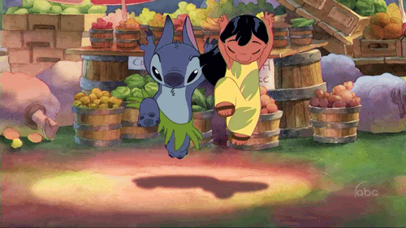

<!--
**BeatrizJardimm/BeatrizJardimm** is a ✨ _special_ ✨ repository because its `README.md` (this file) appears on your GitHub profile.

Here are some ideas to get you started:

- 🔭 I’m currently working on ...
- 🌱 I’m currently learning ...
- 👯 I’m looking to collaborate on ...
- 🤔 I’m looking for help with ...
- 💬 Ask me about ...
- 📫 How to reach me: ...
- 😄 Pronouns: ...
- ⚡ Fun fact: ...
-->

  

# Olá!! Eu sou a bia! 😄

- Atualmente estou estudando Ciência da Computação na PUCPR.
- Trabalho na área de QA da Compass UOL.
- Tenho interesse em projetos Front-End.
- Se é Python me chama!
- Gosto muito da Taylor Swift e do Flamengo.

<!--
- I'm studying Computer Science at PUCPR.
- I work at Compass UOL as part of the QA team.
- I have interest in Front-End projects.
- Are you using Python?? Count me in!
- I like Taylor Swift and Flamengo very much.
-->

  <a href="https://github.com/BeatrizJardimm">
  
  

  
  

  
   
 
